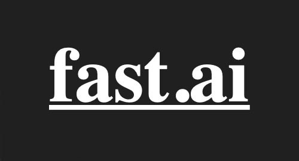

# Welcome to my Website
This is my personal website to document my projects. This website documents the code for the projects.

This website will also include text tutorials for projects as well as video guides in the future.

Currently planned tutorials include using FastAI on VastAI and modifying a docker image to save bandwidth.

## Resources Used

FastAI is a great library to get quickly started with machine learning projects. However, this library
requires the use of an Nvidia GPU. For learners that do not have an Nvidia GPU, resources such as Paperspace 
and VastAI can provide remote GPU resources to allow anyone to use FastAI with just a browser.

[Recommendations for Cloud GPU compute providers](recommendations)

[How to use FastAI on VastAI](projects/fastaivastai)

Remote compute services do not require the user to install everything manually. Rather, they provide the option 
of using docker images. Docker images are portable enviornments with everything set up for the user. Thus, they 
do not need to worry about installing dependencies for programs and can get straight to work.
